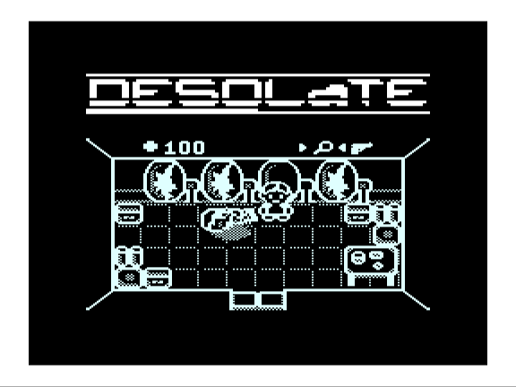
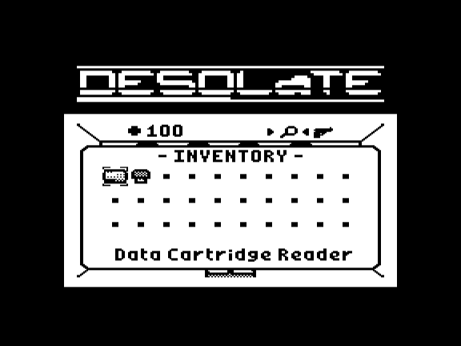
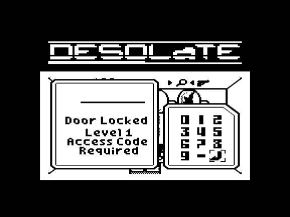

# vector06c-desolate
Porting **Desolate** game from TI-83 Plus calculator to soviet computer [Vector-06c](https://en.wikipedia.org/wiki/Vector-06C) (Вектор-06Ц).

Thanks a lot to [zx-pk.ru forum](https://zx-pk.ru/forums/55-vektor.html) members for all the help and support!

Porting status: released.

  

Controls to use in the game:
 - Movement: arrows
 - Look/shoot: <kbd>УС</kbd>, <kbd>Space</kbd>
 - Look/Shoot switch: <kbd>ТАБ</kbd>, <kbd>РУС/ЛАТ</kbd>
 - Inventory: <kbd>I</kbd>, <kbd>M</kbd>
 - Close all pop-ups (Escape): <kbd>АР2</kbd>, <kbd>ЗБ</kbd>, <kbd>ПС</kbd>
 - Exit to Menu: <kbd>P</kbd>, <kbd>R</kbd>

## The original game

Written by Patrick Prendergast (tr1p1ea) for TI-83/TI-84 calculators.

Links:
 - [Desolate game description and files](https://www.ticalc.org/archives/files/fileinfo/348/34879.html)
 - [Wabbit emulator site](http://wabbitemu.org/) and [GitHub](https://github.com/sputt/wabbitemu)

To run the game on Wabbitemu emulator:
 1. Run Wabbitemu, select ROM file
 2. File Open `DesData.8xp`
 3. <kbd>MEM</kbd>, select Archive; <kbd>PRGM</kbd>, select DesData; <kbd>ENTER</kbd>
 4. File Open `Desolate.8xp`
 5. File Open `MIRAGEOS.8xk`
 6. <kbd>APPS</kbd> select MirageOS
 7. Select Main > Desolate

## Tools for the tools folder

 - `pasmo.exe` cross-assembler
   http://pasmo.speccy.org/

 - `tasm.exe` compatible with Windows 10 + `TASM85.TAB`
   http://old-dos.ru/dl.php?id=1926

 - `zx0.exe`
   https://github.com/einar-saukas/ZX0/blob/main/win/zx0.exe

## Links

 - [Discussion on zx-pk.ru (in Russian)](https://zx-pk.ru/threads/32499-sovremennaya-razrabotka-pod-vektor.html)
 - [Desolate port on ZX Spectrum](https://github.com/nzeemin/spectrum-desolate)
 - [Desolate port on UKNC](https://github.com/nzeemin/uknc-desolate)

